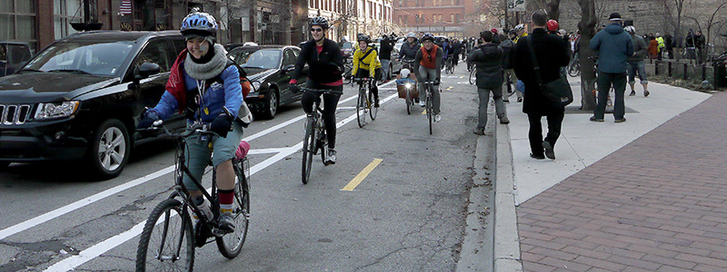

# Bicyclist Safety Analysis




Help improve pedestrian and cyclist safety via image analysis. 

The primary objectives of a Bicycle Safety Assessment \(BSA\) are:

* To improve bicycle safety in a city or county
* To create safe, comfortable, accessible, welcoming environments for cyclists
* To enhance the bikeability and economic vitality of local districts

Use advance Image  and video analysis to improve cyclist safety.  

* Determine how well cars keep clear of bike lanes
* Determine bike lane usage and capacity



## Cloudinary APIs

**Upload Widget:**

{% embed data="{\"url\":\"https://cloudinary.com/blog/how\_to\_let\_your\_users\_upload\_images\_directly\_from\_facebook\_dropbox\_and\_more\",\"type\":\"link\",\"title\":\"How to let your users upload images directly from Facebook, Dropbox and more\",\"description\":\"How to use a JavaScript upload widget UI to let your users pick images from Facebook albums, Dropbox folders, Google Photos, Image Search results and more\",\"icon\":{\"type\":\"icon\",\"url\":\"https://cloudinary-res.cloudinary.com/image/asset/favicon-192x192-d6a96e11dd5adfebbb717d154665ee80.png\",\"width\":192,\"height\":192,\"aspectRatio\":1},\"thumbnail\":{\"type\":\"thumbnail\",\"url\":\"https://cloudinary-res.cloudinary.com/image/upload/upload\_widget\_media\_sources\_post.jpg\",\"width\":2260,\"height\":1196,\"aspectRatio\":0.5292035398230088}}" %}

**Upload API**

{% embed data="{\"url\":\"https://cloudinary.com/documentation/upload\_images\",\"type\":\"link\",\"title\":\"Image Upload - Image Management for Developers \| Cloudinary\",\"description\":\"Learn how to upload images with only a few lines of code - with cloud storage, CDN delivery, image optimization and post-upload image effects.\",\"icon\":{\"type\":\"icon\",\"url\":\"https://cloudinary-res.cloudinary.com/image/asset/favicon-192x192-d6a96e11dd5adfebbb717d154665ee80.png\",\"width\":192,\"height\":192,\"aspectRatio\":1}}" %}

**Upload Presets**

{% embed data="{\"url\":\"https://cloudinary.com/blog/centralized\_control\_for\_image\_upload\_image\_size\_format\_thumbnail\_generation\_tagging\_and\_more\",\"type\":\"link\",\"title\":\"Centralized control for image upload - image size, format, thumbnail generation, tagging and more\",\"description\":\"Learn how to centrally define image upload options like size, format, thumbnails and tagging, with Cloudinary\'s image management solution.\",\"icon\":{\"type\":\"icon\",\"url\":\"https://cloudinary-res.cloudinary.com/image/asset/favicon-192x192-d6a96e11dd5adfebbb717d154665ee80.png\",\"width\":192,\"height\":192,\"aspectRatio\":1},\"thumbnail\":{\"type\":\"thumbnail\",\"url\":\"https://cloudinary-res.cloudinary.com/image/upload/upload\_presets\_post\_wpdhzn.png\",\"width\":584,\"height\":588,\"aspectRatio\":1.0068493150684932}}" %}

**Auto Tagging**

{% embed data="{\"url\":\"https://cloudinary.com/blog/how\_to\_leverage\_multiple\_categorization\_engines\_for\_improved\_automatic\_tagging\",\"type\":\"link\",\"title\":\"How to leverage multiple categorization engines for improved automatic tagging\",\"description\":\"Improve the relevance and accuracy of your image tags by leveraging multiple engines to provide a more expansive list of tags\",\"icon\":{\"type\":\"icon\",\"url\":\"https://cloudinary-res.cloudinary.com/image/asset/favicon-192x192-d6a96e11dd5adfebbb717d154665ee80.png\",\"width\":192,\"height\":192,\"aspectRatio\":1},\"thumbnail\":{\"type\":\"thumbnail\",\"url\":\"https://res.cloudinary.com/demo/image/upload/blog\_multi\_tag.jpg\",\"width\":1920,\"height\":1080,\"aspectRatio\":0.5625}}" %}

## Other Apis

**IBM Watson Visual Recognition**



**Open Data**

{% embed data="{\"url\":\"https://opendata.miamidade.gov\",\"type\":\"link\",\"title\":\"Miami-Dade County - Open Data Portal \| Miami-Dade County - Open Data Portal\",\"icon\":{\"type\":\"icon\",\"url\":\"https://opendata.miamidade.gov/stylesheets/images/icons/retina\_display\_icon.png?10435c87a2076f3c7c6d53988b6d4b4563664992.3833.1498149998\",\"aspectRatio\":0},\"thumbnail\":{\"type\":\"thumbnail\",\"url\":\"//opendata.miamidade.gov/stylesheets/images/common/socrata\_logo\_square.png\",\"width\":130,\"height\":131,\"aspectRatio\":1.0076923076923077}}" %}

**Functions as a Service \(FaaS\)**



{% embed data="{\"url\":\"https://opendata.miamidade.gov\",\"type\":\"link\",\"title\":\"Miami-Dade County - Open Data Portal \| Miami-Dade County - Open Data Portal\",\"icon\":{\"type\":\"icon\",\"url\":\"https://opendata.miamidade.gov/stylesheets/images/icons/retina\_display\_icon.png?10435c87a2076f3c7c6d53988b6d4b4563664992.3833.1498149998\",\"aspectRatio\":0},\"thumbnail\":{\"type\":\"thumbnail\",\"url\":\"//opendata.miamidade.gov/stylesheets/images/common/socrata\_logo\_square.png\",\"width\":130,\"height\":131,\"aspectRatio\":1.0076923076923077}}" %}



**Understanding Bicycle Saftey**

{% embed data="{\"url\":\"https://en.wikipedia.org/wiki/Bicycle\_safety\",\"type\":\"link\",\"title\":\"Bicycle safety\",\"description\":\"Bicycle safety is the use of road traffic safety practices to reduce risk associated with cycling. Risk can be defined as the number of incidents occurring for a given amount of cycling. In many countries both the number of incidents and the amount of cycling are not well known. Non-fatal accidents often go unreported and bicycle use is only occasionally monitored. Some of this subject matter is hotly debated: for example, the discussions as to whether bicycle helmets or cyclepaths really improve safety. The merits of obeying the rules of the road including the use of bicycle lighting at night are less controversial.\",\"icon\":{\"type\":\"icon\",\"url\":\"https://en.wikipedia.org/static/apple-touch/wikipedia.png\",\"aspectRatio\":0},\"thumbnail\":{\"type\":\"thumbnail\",\"url\":\"https://upload.wikimedia.org/wikipedia/commons/thumb/9/9b/Bike\_slalom\_FHP\_Prospect\_jeh.JPG/1200px-Bike\_slalom\_FHP\_Prospect\_jeh.JPG\",\"width\":1200,\"height\":1082,\"aspectRatio\":0.9016666666666666}}" %}



