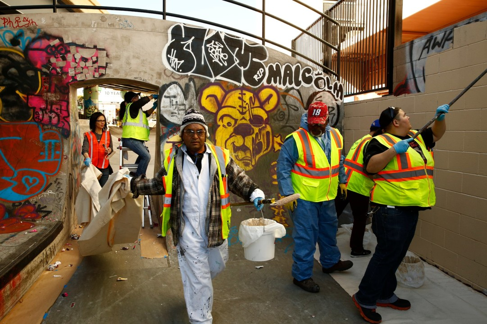
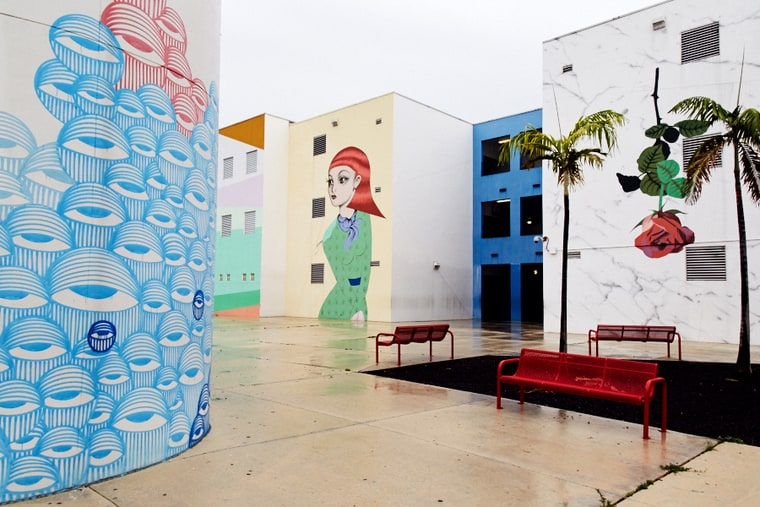

# Croud-sourced Graffiti Abatement




Build an app that can capture images, location data and the meta of graffiti. Use visual image recognition and analysis AI to train and recognize tags from specific offenders. Send notifications to your city's graffiti abatement division.  



## Cloudinary APIS {#cloudinary-apis}

**Upload Widget**

{% embed data="{\"url\":\"https://cloudinary.com/blog/how\_to\_let\_your\_users\_upload\_images\_directly\_from\_facebook\_dropbox\_and\_more\",\"type\":\"link\",\"title\":\"How to let your users upload images directly from Facebook, Dropbox and more\",\"description\":\"How to use a JavaScript upload widget UI to let your users pick images from Facebook albums, Dropbox folders, Google Photos, Image Search results and more\",\"icon\":{\"type\":\"icon\",\"url\":\"https://cloudinary-res.cloudinary.com/image/asset/favicon-192x192-d6a96e11dd5adfebbb717d154665ee80.png\",\"width\":192,\"height\":192,\"aspectRatio\":1},\"thumbnail\":{\"type\":\"thumbnail\",\"url\":\"https://cloudinary-res.cloudinary.com/image/upload/upload\_widget\_media\_sources\_post.jpg\",\"width\":2260,\"height\":1196,\"aspectRatio\":0.5292035398230088}}" %}

**Upload API**

{% embed data="{\"url\":\"https://cloudinary.com/documentation/upload\_images\",\"type\":\"link\",\"title\":\"Image Upload - Image Management for Developers \| Cloudinary\",\"description\":\"Learn how to upload images with only a few lines of code - with cloud storage, CDN delivery, image optimization and post-upload image effects.\",\"icon\":{\"type\":\"icon\",\"url\":\"https://cloudinary-res.cloudinary.com/image/asset/favicon-192x192-d6a96e11dd5adfebbb717d154665ee80.png\",\"width\":192,\"height\":192,\"aspectRatio\":1}}" %}

**Upload Presets**

{% embed data="{\"url\":\"https://cloudinary.com/blog/centralized\_control\_for\_image\_upload\_image\_size\_format\_thumbnail\_generation\_tagging\_and\_more\",\"type\":\"link\",\"title\":\"Centralized control for image upload - image size, format, thumbnail generation, tagging and more\",\"description\":\"Learn how to centrally define image upload options like size, format, thumbnails and tagging, with Cloudinary\'s image management solution.\",\"icon\":{\"type\":\"icon\",\"url\":\"https://cloudinary-res.cloudinary.com/image/asset/favicon-192x192-d6a96e11dd5adfebbb717d154665ee80.png\",\"width\":192,\"height\":192,\"aspectRatio\":1},\"thumbnail\":{\"type\":\"thumbnail\",\"url\":\"https://cloudinary-res.cloudinary.com/image/upload/upload\_presets\_post\_wpdhzn.png\",\"width\":584,\"height\":588,\"aspectRatio\":1.0068493150684932}}" %}

**Auto Tagging**

{% embed data="{\"url\":\"https://cloudinary.com/blog/how\_to\_leverage\_multiple\_categorization\_engines\_for\_improved\_automatic\_tagging\",\"type\":\"link\",\"title\":\"How to leverage multiple categorization engines for improved automatic tagging\",\"description\":\"Improve the relevance and accuracy of your image tags by leveraging multiple engines to provide a more expansive list of tags\",\"icon\":{\"type\":\"icon\",\"url\":\"https://cloudinary-res.cloudinary.com/image/asset/favicon-192x192-d6a96e11dd5adfebbb717d154665ee80.png\",\"width\":192,\"height\":192,\"aspectRatio\":1},\"thumbnail\":{\"type\":\"thumbnail\",\"url\":\"https://res.cloudinary.com/demo/image/upload/blog\_multi\_tag.jpg\",\"width\":1920,\"height\":1080,\"aspectRatio\":0.5625}}" %}

### Other APIs

**IBM Watson Visual Recognition**



**Open Data**

{% embed data="{\"url\":\"https://opendata.miamidade.gov/\",\"type\":\"link\",\"title\":\"Miami-Dade County - Open Data Portal \| Miami-Dade County - Open Data Portal\",\"icon\":{\"type\":\"icon\",\"url\":\"https://opendata.miamidade.gov/stylesheets/images/icons/retina\_display\_icon.png?10435c87a2076f3c7c6d53988b6d4b4563664992.3833.1498149998\",\"aspectRatio\":0},\"thumbnail\":{\"type\":\"thumbnail\",\"url\":\"//opendata.miamidade.gov/stylesheets/images/common/socrata\_logo\_square.png\",\"width\":130,\"height\":131,\"aspectRatio\":1.0076923076923077}}" %}

[Sample Graffiti Images](http://storage.pardot.com/28622/111653/original_images.json)




**Understanding the difference between Street Art and Graffiti **

> Graffiti vandalism is a form of expression that includes symbols, nicknames, or pictures painted on walls, fences or signs. The graffiti is drawn without the permission of the property owner and is used by the vandal as a means of gaining recognition.
>
> [Miami Dade Gov](http://www.miamidade.gov/building/standards/residential-graffiti.asp)

{% embed data="{\"url\":\"https://www.rollingstone.com/culture/features/wynwood-walls-graffiti-artists-remake-miami-neighborhood-w495766\",\"type\":\"link\",\"title\":\"Meet Street Artists Remaking Miami\'s Wynwood Neighborhood\",\"description\":\"Wynwood Arts District is the city\'s latest hotspot, but a group of dedicated artists continue to transform their neighborhood into a sprawling outdoor gallery\",\"icon\":{\"type\":\"icon\",\"url\":\"https://assets.wennermedia.com/rollingstone/img/favicon/apple-touch-icon.png\",\"width\":180,\"height\":180,\"aspectRatio\":1},\"thumbnail\":{\"type\":\"thumbnail\",\"url\":\"http://img.wennermedia.com/social/miami-artists-wynwood-9ec28b1b-e570-4919-b136-f324e0f49d84.jpg\",\"width\":1200,\"height\":630,\"aspectRatio\":0.525}}" %}



